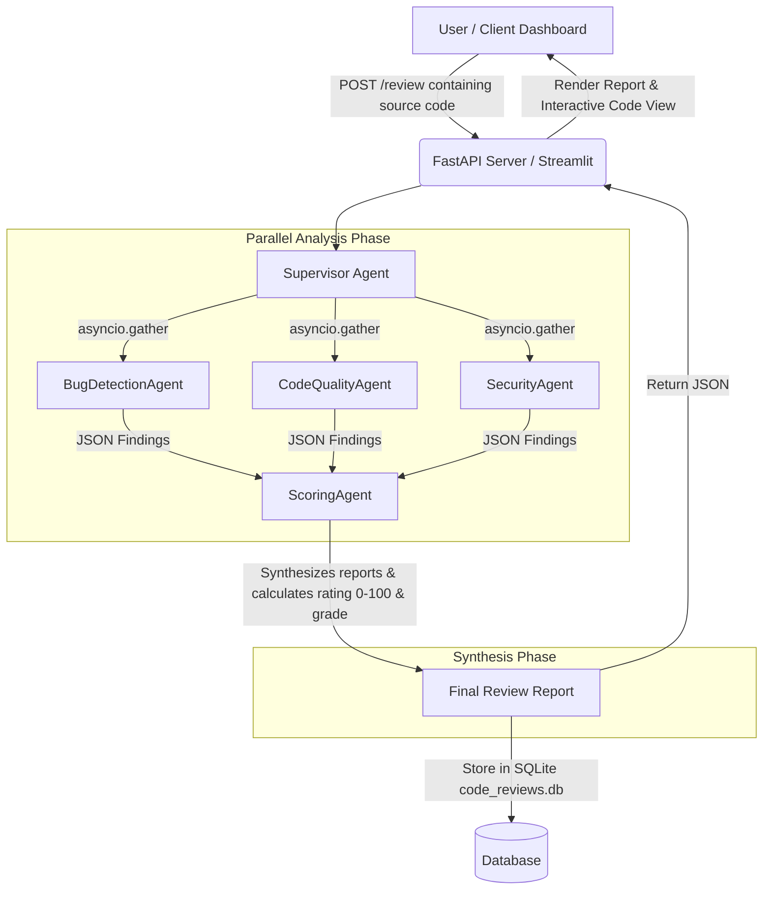
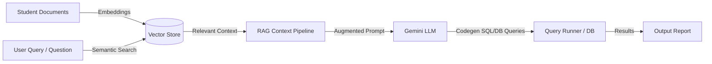

# CodeSentinel AI & RAG Agentic Workspace

Welcome to the **CodeSentinel AI & RAG Agentic Workspace**. This repository contains two major subsystems:
1. 🚀 **CodeSentinel AI (Multi-Agent Code Review Platform):** A state-of-the-art multi-agent code analysis pipeline that utilizes parallel AI agents to audit code for bugs, quality guidelines (PEP-8), and security vulnerabilities, complete with SQLite history persistence and two rich visual dashboards.
2. 🎓 **Student Management RAG System:** A vector-database-driven Retrieval-Augmented Generation (RAG) system that processes student documents, generates query codegen, and runs automated CRUD operations.

---

## 🏛️ Project Architecture & Workflow

### 1. CodeSentinel AI Multi-Agent Pipeline

The code review platform operates using a **two-phase parallel agentic workflow**. It parallelizes specialized analysis tasks before synthesizing a final review report:



#### **Phase 1: Parallel Analysis**
*   **Supervisor Agent (`supervisor.py`):** Orchestrates the workflow. It invokes the analysis agents concurrently using Python's `asyncio.gather` for minimal latency.
*   **BugDetectionAgent (`bug_detection.py`):** Checks for syntax issues, division by zero, mutable default arguments, infinite loops, and exception handling gaps.
*   **CodeQualityAgent (`code_quality.py`):** Checks for PEP-8 styling violations, nesting depth, long lines, missing docstrings, and bad naming conventions.
*   **SecurityAgent (`security.py`):** Audits code for SQL/Shell injection vectors, hardcoded secrets/keys, weak encryption, and unsafe library usage.

#### **Phase 2: Synthesis & Scoring**
*   **ScoringAgent (`scoring.py`):** Consolidates findings from Phase 1, computes an overall project health score (0-100) and grade (A+ through F), highlights key strengths, and summarizes recommendations.
*   **SQLite DB Persistence (`db.py`):** Stores review headers, source code, and full agent JSON payloads.

---

### 2. Student Management & RAG System

This system utilizes Gemini embedding models and a vector database structure to ingest student documents, generate dynamic database queries, and perform semantic RAG lookups:



*   **Vector Store (`vector_store.py`):** Ingests, chunks, embeds, and indexes student profile text files into Weaviate / local storage.
*   **Query Codegen & Runner (`query_codegen.py` / `query_runner.py`):** Takes a natural language request, retrieves relevant metadata context, generates correct database action queries (CRUD), and executes them on `student_database.db`.

---

## 📂 Project Directory Structure

```text
├── code_review_platform/        # CodeSentinel AI Subsystem
│   ├── agents/                  # AI Agent Layer
│   │   ├── base.py              # Base agent configurations & Gemini API setup
│   │   ├── bug_detection.py     # Bug detection agent
│   │   ├── code_quality.py      # Code quality & PEP-8 compliance agent
│   │   ├── security.py          # Security vulnerabilities scanner agent
│   │   ├── scoring.py           # Synthesis and scoring agent
│   │   └── supervisor.py        # Pipeline parallel orchestrator
│   ├── static/                  # FastAPI Static Client UI
│   │   └── index.html           # Premium glassmorphic Single Page Application
│   ├── db.py                    # SQLite code reviews manager
│   ├── main.py                  # FastAPI Backend API entry point
│   ├── streamlit_app.py         # Streamlit UI Dashboard
│   ├── run_all.ps1              # Automation startup script (runs both servers)
│   └── requirements.txt         # Subsystem requirements
│
├── student_management/          # Student Registry RAG Subsystem
│   ├── documents/               # Stored student registry txt records
│   ├── queries/                 # Automatically generated DB operations
│   ├── query_codegen.py         # Dynamic query generation pipeline
│   ├── query_runner.py          # Execution engine for database operations
│   └── student_management.py    # Subsystem core registry definitions
│
├── .gitignore                   # Workspace gitignore (protects secrets/venvs)
├── .env.example                 # Configuration template
├── vector_store.py              # Context ingestion & semantic indexer
├── student_registry.py          # Student registry schema & entities
└── requirements.txt             # Workspace dependencies
```

---

## ⚙️ Setup & Installation

### 1. Prerequisite Configuration
Create a `.env` file in the root workspace directory (use `.env.example` as a starting point) and add your Gemini API Key:

```env
GEMINI_API_KEY=your-actual-api-key-here
```

*(Note: `.env` is fully excluded from version control in `.gitignore` to keep credentials secure.)*

### 2. Install Dependencies
Initialize a virtual environment and install the required workspace dependencies:

```powershell
python -m venv .venv
.venv\Scripts\Activate.ps1
pip install -r requirements.txt
```

---

## 🚀 Running the Services

### Start CodeSentinel AI Platforms
To start both the **FastAPI Backend (port 8000)** and the **Streamlit Dashboard (port 8501)** at once:

```powershell
cd code_review_platform
.\run_all.ps1
```

Once running, you can access the applications at:
*   **Web Dashboard (Premium UI):** `http://localhost:8000/`
*   **Streamlit Dashboard:** `http://localhost:8501/`
*   **FastAPI API Docs:** `http://127.0.0.1:8000/docs`

---

## 🔍 Verification & Testing

To run verification scripts for testing API functionality and Agent behaviors:

*   **Test CodeSentinel Review API:**
    ```powershell
    cd code_review_platform
    python test_api.py
    ```
*   **Test Gemini API Key directly:**
    ```powershell
    python test_gemini.py
    ```
